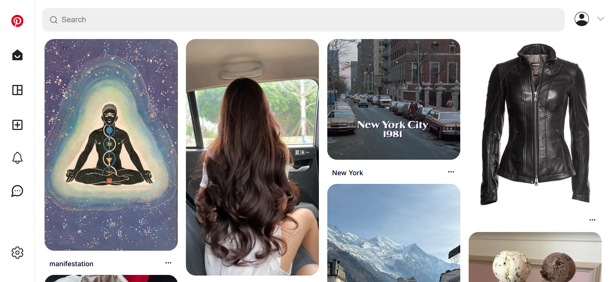

# 📌 Pinterest Clone – MERN Stack
A pixel-perfect, fully responsive Pinterest clone built using the MERN stack. This application replicates core Pinterest functionality with a modern UI, secure authentication, and real-time interactions.

# 📌 Live Demo
[https://name.netlify.app](https://name.netlify.app)

# 📌 Features
 1. Authentication & Authorization: 
  - Secure user sign-up and login
  - JWT-based authentication
  - Protected routes
  - Refresh Token rotation
 2. Interactions
  - Create pins
  - View pins from all users
  - Save pins to your profile
  - Search functionality
  - Like & save other users’ pins
  - Notifications when someone likes or saves your pin
 3. Fully Responsive
  - Pixel-perfect UI matching Pinterest
  - Works seamlessly on desktop, tablet, and mobile
 4. Secure
  - Password hashing
  - Environment-based configuration
  - Secure API endpoints
  - CSRF protection
  - Input validation & HTML sanitization
  - Security headers using Helmet
 5. Highlights
  - Clean and scalable code architecture
  - Real-world MERN stack implementation
  - Production-ready authentication and security

# 📌 Tech Stack
 Frontend : React, CSS, Context API, React Router, Axios
 Backend : Node.js, Express, MongoDB, Mongoose, JWT Authentication, Bcrypt

# 📌 Demo

# 📌 License
This project is for educational purposes only and is not affiliated with Pinterest.